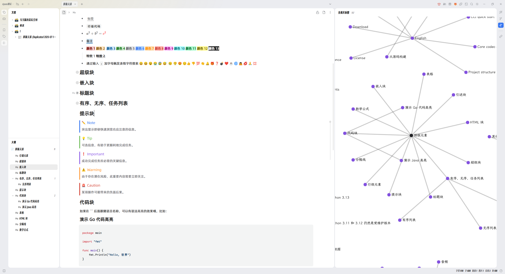

# SiYuan Font Studio

[简体中文](README.md)

Customize every font element in SiYuan!

## Features

- Customize the fonts and sizes used for the interface, document content, monospace text, math formulas, graphs, Emoji, and Mermaid.
- Create custom font presets and import, export, or switch between them.
- Select multiple fonts to provide fallback characters.

## Additional notes

- Graph fonts: SiYuan 3.8 and later use a new graph renderer. The font can still be changed, but the new renderer does not expose an independent font-size interface, so graph font-size settings do not take effect on SiYuan 3.8 and later.
- SiYuan's bundled KaTeX is specially adapted for dedicated math fonts. Keeping `KaTeX_Math` as the first choice and adding other fonts as fallbacks for Chinese characters is recommended.
- Some Mermaid elements use independent fixed font sizes, so the plugin cannot override the font size of every diagram element.
- WOFF2 is recommended because it is smaller. TTF/OTF fonts can be converted online with [CloudConvert](https://cloudconvert.com/ttf-to-woff2) or with my [FontConvert](https://github.com/MDfox-ChaosZone/Font-Converter) project.
- An example font preset will be available in Releases for users to download and import. You are also welcome to share your own font presets by opening a GitHub Issue. I will feature them here as well.

  

## License

[MIT](LICENSE)

## Support and sponsorship

If this project is useful to you, you are welcome to leave a tip. Any sponsorship is greatly appreciated.

### WeChat Pay and Alipay

  
  

### USDT

- Plasma: `0x742fa2ac27c5d3ff0c337b93ad688d39a77da4c8`
- Aptos: `0xb3ba1611884cc1c2d2d970d081f6c24089d363817a772bddab52a0a278c6ffef`

  
  

When transferring USDT, please verify both the network and wallet address.
