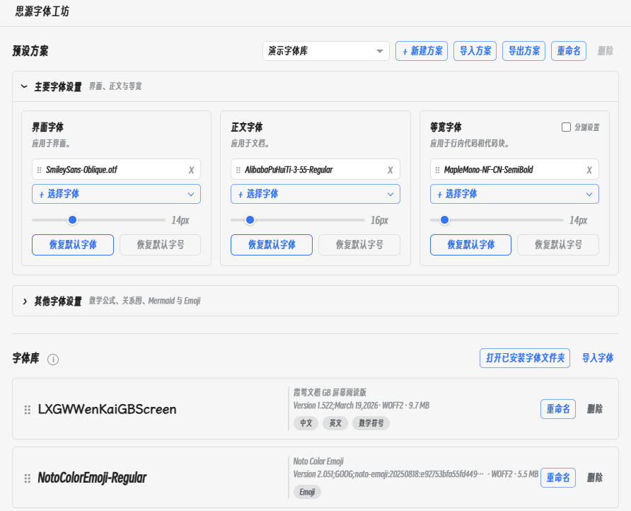

# SiYuan Font Studio

[简体中文](README.zh-CN.md)

Import local fonts into [SiYuan](https://github.com/siyuan-note/siyuan), then configure font families, fallback order, and sizes independently for different parts of the interface and editor.



## Features

- Customize fonts and sizes for the interface, document content, monospace text, math, graphs, Emoji, and Mermaid.
- Create, rename, switch, import, and export font presets.
- Select and reorder multiple fonts to build fallback stacks for missing characters.
- Import WOFF2, WOFF, TTF, and OTF files in batches.
- Preview, rename, delete, validate, and automatically deduplicate imported fonts.
- Use imported fonts, installed system fonts, or SiYuan defaults.
- Keep separate font settings for inline/block code and inline/block math.
- Apply changes immediately and restore them after restarts or theme changes.

## Usage

After enabling the plugin, click the font icon in SiYuan's top bar or run **Open SiYuan Font Studio** from the command palette. Import fonts into the library, then assign them to the desired targets in priority order.

WOFF2 is recommended because it is usually much smaller than TTF or OTF. Existing TTF/OTF files can be converted with [CloudConvert](https://cloudconvert.com/ttf-to-woff2) or [FontConvert](https://github.com/MDfox-ChaosZone/Font-Converter).

Imported font files are stored under `data/storage/petal/siyuan-font-studio/fonts/`.

## Additional notes

- SiYuan 3.8.0 or later is required.
- SiYuan 3.8 and later use a new graph renderer. It still supports changing the graph font family, but does not expose an independent graph-label size option, so the graph size control currently has no effect.
- SiYuan's bundled KaTeX is optimized for dedicated math fonts. Keep `KaTeX_Math` first and use additional fonts as fallbacks for Chinese characters.
- Some Mermaid elements use independent font-size rules. The plugin changes the primary diagram text but cannot override every element.
- PDF viewers, third-party iframe content, and exported documents are outside the plugin's styling scope.
- Each imported file is a separate font entry; different weights are not grouped automatically.
- The plugin declares support for all SiYuan frontend and backend platforms. **Open installed font folder** is available only on desktop.
- Example font presets will be provided in Releases for users to download and import.
- Community presets are welcome through [GitHub Issues](https://github.com/MDfox-ChaosZone/siyuan-font-studio/issues). Approved submissions may be featured in Releases.

## Development

Node.js 24 and pnpm 11 are required.

```bash
pnpm install
pnpm check
```

For local development, close SiYuan and create a development link in a workspace:

```powershell
pnpm dev:setup -- "D:\\path\\to\\your\\SiYuanWorkspace"
pnpm dev
```

`pnpm dev` watches the source and writes `index.js`, `index.css`, and `i18n/`. Production builds are written to `dist/`, and the generated `package.zip` can be attached directly to a GitHub Release.

## License

[MIT](LICENSE)

## Support and sponsorship

If SiYuan Font Studio is useful to you, you are welcome to leave a tip for the project. Any sponsorship is greatly appreciated.

### WeChat Pay and Alipay

<p align="center">
  
  
</p>

### USDT

- Plasma: `0x742fa2ac27c5d3ff0c337b93ad688d39a77da4c8`
- Aptos: `0xb3ba1611884cc1c2d2d970d081f6c24089d363817a772bddab52a0a278c6ffef`

<p align="center">
  
  
</p>

When transferring USDT, please verify both the network and wallet address.
