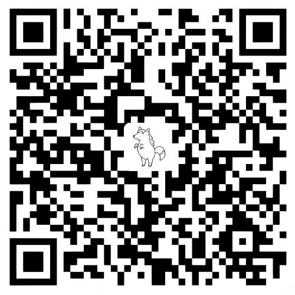

# 思源字体工坊

[English](https://github.com/MDfox-ChaosZone/siyuan-font-studio/blob/main/README.en.md)

字体过家家：

- 轻松自定义思源中的多种字体元素！
- 自由组合并轻松切换你的字体方案！

## 功能

支持修改以下元素的字体和字号：

| 字体元素 | 可修改字体 | 可修改字号 | 具体范围 |
| --- | :---: | :---: | --- |
| 界面 | ✅ | ✅ | 菜单、设置、文档树、标签栏、侧栏等思源界面 |
| 文档 | ✅ | ✅ | 文档中的普通正文、标题、列表、引述、表格等内容 |
| 代码 | ✅ | ✅ | 行内代码和代码块；两者可分开设置 |
| 公式 | ✅ | ✅ | 行级公式和公式块；两者可分开设置 |
| 关系图 | ✅ | ❌ | 关系图和全局关系图 |
| Mermaid | ✅ | 部分 | 部分 Mermaid 图表元素使用独立的固定字号，无法统一覆盖 |
| Emoji | ✅ | ❌ | 文档树、文档内容等位置显示的 Emoji |

- 可将字体组合保存为预设方案，轻松切换字体方案；支持导入和导出，方便分享并在多设备间使用。
- 支持选择多个字体，作为缺失字符的候补字体。

## 分享字体方案

1. 在插件中保存方案，点击“导出”。如果包含字体且压缩包超过 25 MB，勾选“分享至 GitHub Issue 时拆分”，保存全部 ZIP 分包。
2. 点击插件“下载字体方案 → 分享我的方案”，或直接打开[分享表单](https://github.com/MDfox-ChaosZone/siyuan-font-studio/issues/new?template=share-font-preset.yml)。保留标题前缀，填写自拟名称，并上传方案文件；简介和效果截图可选。全部分包须放在同一个 Issue 中。
3. 提交后等待自动检查和人工审核。通过后，方案会出现在插件的下载页。请只分享允许再分发的字体；不确定授权时导出仅含设置的 JSON。

想撤回已发布方案，原投稿者关闭自己的投稿 Issue 即可。详细规则见[社区方案说明](docs/community-presets.md)。

## 额外说明

- 关系图字体：思源 3.8 及以上版本采用新版关系图渲染器，目前仅支持修改字体，不提供字号设置。
- 推荐使用体积更小的 WOFF2 字体格式。TTF/OTF 格式字体可以通过 [CloudConvert](https://cloudconvert.com/ttf-to-woff2) 在线转换，或使用我的项目 [FontConvert](https://github.com/MDfox-ChaosZone/Font-Converter) 转换。

## 更新记录

- **v0.1.7**：完善可变字体支持；修复公式候补字体字重不生效，以及候补字体错误覆盖 KaTeX 数字和运算符的问题；修复思源 3.8.3 中下载示例方案时提示“保存设置失败：[object Object]”的问题。
- **v0.1.6**：增加对字体字重的显示和选择功能，并适配思源 3.8.2 版本。
- **v0.1.5**：新增示例字体方案的按需下载与自动导入功能，并优化预设方案工具栏布局。
- **v0.1.4 及以前**：完成插件基本功能。

## 许可证

[MIT](LICENSE)

## 支持与赞助

如果这个插件对你有帮助，欢迎在 GitHub 上**点个 Star**，这对我很重要！求求了！

此外，任何赞助都不胜感激哦！

### 微信支付与支付宝

| 微信支付 | 支付宝 |
| :---: | :---: |
|  |  |

### USDT

- Plasma：`0x742fa2ac27c5d3ff0c337b93ad688d39a77da4c8`
- Aptos：`0xb3ba1611884cc1c2d2d970d081f6c24089d363817a772bddab52a0a278c6ffef`

| Plasma | Aptos |
| :---: | :---: |
|  |  |
